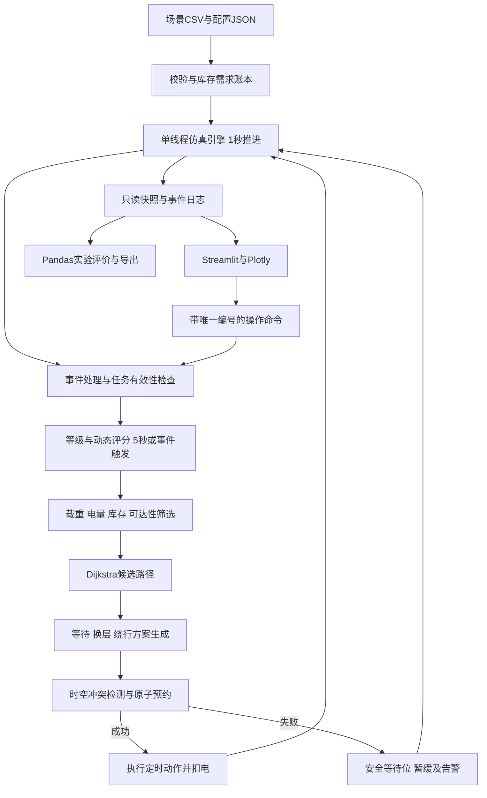

# 应急智航完整修订项目方案

面向紧急物资运输的无人机任务优先级动态调整系统

适用对象：大一学生四人团队。开发周期：14天。技术范围：Python、Streamlit、NetworkX、Dijkstra、Pandas、Plotly及Python标准库。交付目标：能够复现调度决策、验证安全约束、导出对照实验的离散仿真原型。

本方案以“任务有效性检查—分级动态评分—可行性筛选—时空预约—仿真执行”为主线。急救任务通过等级隔离保护；高度避让必须预约升降过程和出口；等待与绕行使用同一套时间、电量和风险成本比较。所有高度、速度、耗电、阈值均为教学仿真初值，不代表实际飞行安全标准或机型性能。实验结果应运行后填写，不预设动态算法一定更优。

# 第一部分：原始方案漏洞清单

以下覆盖所提供Word原文和本次核心简介中能够识别的设计缺口。原文确实提出了“指标归一化到0～100”，问题是没有定义具体方法、基准与异常处理，并非完全没有归一化意识。

## 1 优先级计算漏洞

|编号|问题|造成后果及修订方向|
|---|---|---|
|P01|U、T、S、N、A只有含义，没有可执行映射|人数、秒、缺口量直接加权会使大数值指标支配结果；统一为0～1后评分。|
|P02|未规定固定归一化基准|若使用当前任务批次的最大最小值，新任务加入会改变旧任务分数；采用固定场景基准并随实验配置保存。|
|P03|截止压力只有“越近越高”|使用1/剩余时间会在截止点除零、超时后变负；用包含预计送达时间的松弛量及截断函数。|
|P04|未纳入航程和装卸时间|两个相同截止时间的任务可能只有远程任务已经来不及；压力采用剩余服务时长估计。|
|P05|等待补偿没有上限|普通任务可能无限反超急救，分数超过100；补偿封顶且急救采用独立等级。|
|P06|物资类型等同于生命紧急程度|普通药品可能压过断水救命任务；紧急等级由场景明确输入，物资类型仅给出默认严重度。|
|P07|0.30等权重没有验证依据|只能说明人为偏好，不能证明最优；保留作为初值，开展敏感性与消融实验。|
|P08|缺少超时惩罚和有效期|超时任务可能无限占用运力，过期血液仍被送达；区分截止时间、硬失效时间和软超时损失。|
|P09|受影响人数没有封顶及缺失规则|异常人数值压倒急救，NaN破坏排序；固定对数归一化并校验输入。|
|P10|等待时间没有定义|飞行时间、排队时间可能重复累计；仅累计可调度等待和交通等待，不把正常飞行计入。|
|P11|同分、连续高负载没有规则|运行不可复现，普通任务可能饥饿；明确稳定排序、长等待告警及容量边界，不能承诺无限急救流下人人得到服务。|
|P12|“重算未完成任务”与“重分配”混用|可能把已装载任务瞬移给另一架飞机；区分评分更新、未装载改派与在途路线调整。|

## 2 交叉口与高度避让漏洞

|编号|问题|造成后果及修订方向|
|---|---|---|
|C01|仅“高优先级通过、低优先级等待”|无法利用高度空间，高负载排队严重；融合等待、换层和绕行。|
|C02|“同时到达”没有时间窗口|整数帧之间可能发生穿越冲突；使用连续动作区间及安全时间缓冲。|
|C03|只检测节点，不检测航段|对向交换位置、同向追尾和几何交叉漏检；预约无向物理航段和路口资源。|
|C04|没有高度层和允许升降地点|可随意升降、越过禁飞层；增加离散层、通道允许层、固定升降等待区。|
|C05|高度改变被当作瞬时动作|低估时间与电量，升降过程可能穿过其他飞机；增加升降动作与穿层互斥资源。|
|C06|没有高度策略优先级|可能为等2秒而换层20秒；先满足硬约束，再按成本选择，短等待在代价接近时优先。|
|C07|没有出口和等待位容量|飞机进入后无法驶离，形成堵塞或死锁；原子预约到下一安全等待位。|
|C08|多架无人机独立抢占|重复授予同一通行权；单线程仲裁、逐机提交、稳定平局规则。|
|C09|高优先级可以任意抢占的含义不清|可能撤销已经进入路口的飞机许可；已执行动作与近端承诺锁定。|
|C10|没有处理不同高度汇合|高层穿越安全不等于降层及终点着陆安全；检查汇合节点、升降柱、地面装卸位。|
|C11|等待补偿被当作死锁解决方案|提高分数不会释放已占资源；增加出口预留、禁止停在路口、无进展监测。|
|C12|失联后是否删除占用未定义|失联飞机可能仍在空域，直接释放造成“幽灵碰撞”；保留不确定占用并关闭相关资源。|

## 3 仿真与工程漏洞

|编号|问题|造成后果及修订方向|
|---|---|---|
|E01|航路代价把秒与拥堵、风险直接相加|0.5和0.8没有单位或标定依据；全部转为等效秒且非负。|
|E02|把动态拥堵直接交给静态Dijkstra|静态最短路不自动保证到达时段无冲突；Dijkstra生成候选路径，预约器计算实际动作时间。|
|E03|低电量、载重、返航未约束|路径最短却无法执行；任务分配先检查载重与配送后安全返航能量。|
|E04|运动步长与刷新周期未分离|5秒刷新可能跳过冲突；物理推进1秒，排序5秒，界面刷新独立。|
|E05|事件触发条件和同刻顺序模糊|同一任务可能既取消又完成或被重复处理；确定时间顺序和event_id幂等。|
|E06|故障任务“转移”没有货物账本|已装载或部分送达的物资可能被复制；区分剩余需求、在途货物和可用库存。|
|E07|地图不连通、全部飞机故障无出口|主循环永远运行；最大时长、不可行状态和终止原因必须记录。|
|E08|对照组没有控制冲突和高度机制|性能收益混杂，无法判断来自评分还是多高度；采用相同安全内核和逐项消融。|
|E09|单次演示和预设“显著降低”结论|随机好运被当作算法优势；多种子、成对比较、完整报告失败情形。|
|E10|平均完成时间只算成功任务|抛弃困难任务的算法反而更漂亮；联合报告完成率、失效率及未完成截尾等待。|
|E11|CSV只列选型，没有主键与运行隔离|重复行、覆盖实验、重放不一致；run_id、版本、随机种子、追加日志、原子快照。|
|E12|Streamlit重跑可能重复推进状态|一次点击产生两次事件或重复派机；界面只发命令，唯一引擎写状态。|
|E13|1号主要写方案，3号承担全部仿真|工作不均，关键模块成为单点风险；四人各有独立代码模块、测试和交付。|
|E14|原计划第10天才整合突发事件|高度避让和故障处理没有联调缓冲；第4天跑通闭环，第7天完成高度主链路。|

# 第二部分：完整修订版《应急智航》项目方案

## 1 项目概述

项目模拟应急救灾中医疗物资、食品和饮用水的并发运输。任务新增、需求变化、航路受阻或无人机故障时，系统更新任务等级内评分，给可用无人机分配可行运输任务，并在交叉口自动选择高度避让、原地等待或绕行。

交付为“二维地图＋离散高度层”的2.5D教学仿真。飞机显示在平面地图上，高度用L1/L2/L3标签和轨迹线型表示；升降以定时动作执行。系统不模拟姿态、气动、真实通信协议和实际空域管理，不接入真实无人机。

最小完整范围：8个运输节点、12条双向物理航段、4架无人机、20个任务、3个高度层、1个仓库。扩展到6架和30个任务用于压力实验。仓库库存默认充足但必须记账；配送点之间不转移货物。一架飞机同时只运一种物资的一个批次，批次交付后返仓，避免两周内实现复杂多站配送。

## 2 核心创新点与验收边界

一是把“普通加权排序”改为“等级保护＋可解释动态评分＋有效性门控”，避免补偿项无限抢占急救，同时展示每次分数变化的原因。

二是建立带时间的多高度资源预约，将交叉口通行、升降占用、出口等待位和对向航段纳入同一套检测。高度避让产生可测的时间、电量代价，不是换一个动画高度。

三是以相同输入和安全约束对比等待、换层、绕行组合，报告急救收益与普通任务、电量的代价。上述是本项目的实现特色，不宣称新的理论算法或最优调度。

最终验收必须同时满足：可复现；安全不变量通过；急救等级不被普通补偿跨越；高度完整动作能展示；取消、失效、失联和部分交付有记录；四人模块可独立测试；对照结果来自程序输出。

## 3 系统总体架构

数据单向写入：引擎拥有任务、无人机、预约表和库存的唯一写权限。优先级模块返回分数而不修改位置；路径模块返回候选动作；预约模块返回冲突或提交结果；界面只消费快照、提交命令。避免四个模块分别维护一份“当前状态”。

主模块建议为models.py、io_data.py、engine.py、priority.py、scheduler.py、routing.py、reservation.py、app.py、experiments.py、metrics.py。使用dataclasses、Enum、heapq、json、csv、unittest等标准库；不额外引入复杂调度框架。

现成方案预检：NetworkX已提供Dijkstra，无需自写最短路；开源w9-pathfinding的ReservationTable提供节点与边的时间约束设计参考。为保留既定技术栈，本项目不把它作为运行依赖，只实现小规模资源预约器。此处“自建”范围是本项目特定的三层动作及账本逻辑。

## 4 输入参数与基础场景

### 4.1 单位和参数

|参数|定义与单位|初值或约束|
|---|---|---|
|仿真时间t|从场景开始计，秒|非负整数；所有动作耗时向上取整到1秒|
|Δt与Δscore|执行步长、评分周期|1秒、5秒；事件可立即触发重算|
|h|航行高度，米|L1=40、L2=60、L3=80；地面G=0|
|v、v_up、v_down|水平、上升、下降速度|10、2、2米/秒|
|g|预约安全时间缓冲|前后各2秒；仅教学参数|
|H_res|未来搜索时间窗|180秒；失败暂缓，不声明全局无路|
|t_lock|已承诺动作锁定窗|未来5秒内即将开始及正在执行的动作|
|H_T、H_L、H_A|压力、迟到、等待归一化时间|300、300、300秒，均必须大于0|
|N_ref|人数归一化固定基准|1000人；超过该值截断|
|B_cap、B_res|电池容量、保底能量|100能量单位、15单位；不是瓦时|
|e_h、e_up、e_down、e_hold|水平、上升、下降、悬停耗电率|0.05、0.12、0.08、0.04能量单位/秒|
|e_ground|地面等待耗电率|0.005能量单位/秒；装卸也采用此值|
|Q_cap|每架载重|5千克；任务量、库存、需求均统一千克|
|t_load、t_drop、t_charge|装载、交付、电池周转耗时|各5秒、5秒、120秒；返仓换电使电池回到100|
|λ_E、λ_R|能量、风险折为等效秒|10秒/能量单位、30秒/风险暴露单位|
|T_end|统一仿真截止|1800秒；停止接收时间由场景配置|

高度间距、耗电和安全缓冲均需在敏感性实验中改变，不能解释为现实无人机的推荐配置。任何参数改变都要写入本次运行配置。

### 4.2 数据字段

|对象|必须字段|校验与用途|
|---|---|---|
|任务Task|task_id、demand_id、site_id、cargo_type、release_s、deadline_s、expiry_s、level、severity、quantity_kg、people|level∈{0,1,2}；severity∈[0,5]；0≤release≤deadline≤expiry；expiry可以为空表示无硬失效|
|任务运行态|delivered_kg、reserved_kg、in_transit_kg、lost_kg、wait_s、status、version|非负；失效等终态不再评分；父任务允许多批次交付|
|无人机Drone|drone_id、node/edge、layer、action、action_end_s、battery、capacity_kg、cargo_batch_id、status|飞行中保存edge与进度；电量0～100；地面与空中状态分开|
|节点Node|node_id、x_m、y_m、kind、allowed_layers、holding_slots、vertical_allowed|全图坐标单位米；等待位和升降口明确建模|
|物理航段Edge|edge_id、u、v、length_m、allowed_layers、congestion、risk、closed|双向共用物理edge_id；长度>0；拥堵和风险∈[0,1]|
|需求账本Demand|demand_id、site_id、cargo_type、required_kg、delivered_kg、cancelled_kg|每个独立demand_id只建一个父任务；同点同物资可有不重叠需求批次，需求增加更新原ID版本|
|事件Event|event_id、time_s、event_type、target_id、payload|唯一编号；同一编号最多处理一次；禁止未知字段悄悄忽略|
|预约Reservation|reservation_id、drone_id、resource_id、start_s、end_s、plan_version、locked|半开区间[start,end)；端点相接不重叠，安全缓冲另加|

任务状态采用PENDING、ACTIVE、COMPLETED、CANCELLED、EXPIRED；“暂时无路”“无库存”作为阻塞原因，不作为永久失败。无人机采用IDLE、LOADING、FLYING、HOLDING、VERTICAL、UNLOADING、RETURNING、CHARGING、LOST、FAILED。任务有效性、飞机动作状态、失败原因分开，避免一个status承担所有含义。

### 4.3 可复现地图

8个节点坐标：W(0,0)、A(200,0)、B(400,0)、C(0,200)、X(200,200)、D(400,200)、E(0,400)、F(400,400)。W为仓库，其余可设为需求点，X为主要交叉口。

12条物理航段：W-A、A-B、W-C、C-X、X-D、B-D、C-E、E-F、D-F、A-X、X-F、E-X。长度使用欧氏距离；双向共享同层占用资源。所有几何交叉必须落在图节点上；后续改图出现边内交叉时，应分割航段或显式增加冲突资源，不能仅凭图上“没有节点”判定安全。

所有节点都有位于交叉口外的独立等待区；每层设6个抽象等待位，容量覆盖最大机队规模。不同等待位视为水平隔离，每个位对应固定编号；这是降低死锁复杂度的教学假设，压力实验另测容量缩减。节点升降口一次只允许一架飞机使用，所有层共用；仓库和配送点各设1个地面装卸位。

## 5 完整数学模型

### 5.1 有效性先于评分

定义clip(x)=min(1,max(0,x))。任务i仅在已发布、未终态、剩余需求大于0时进入评分集合。未到发布时间不排队；quantity≤0或非有限数拒绝导入；人数为0合法；负人数拒绝。空字段不按0悄悄填补：缺少severity、时间或需求时停止该场景导入并指出行号。

deadline是希望完成的软截止，expiry是物资或需求的硬失效时间。t>deadline但t<expiry仍可配送并受迟到惩罚；t≥expiry且未完成时进入EXPIRED，不再新发运。没有硬有效期的食品任务expiry为空，迟到不等于自动作废。

预计在expiry或之后完成交付的批次不可新发运。在途预测失效时先触发告警及安全返仓方案；不允许凭空丢弃货物或消失。失效任务已交付部分保留，剩余量记失效缺口。

### 5.2 五指标与迟到项

E_i为业务紧急等级：2=直接关系生命救援的急救；1=紧迫保障；0=普通保障。等级由场景设置与人工变更事件决定，等待不能自动升级等级。物资类型和等级分开，例如常规药品可以是E=0，断水救命任务可以是E=2。

U_i=clip(severity_i/5)，取值[0,1]。severity建议血液急救5、急救药品4.5、紧迫饮水4、普通食品3、帐篷2；这些只是场景初值，同一物资允许根据需求调整。

设r_hat_i(t)为预计剩余服务时间，slack_i(t)=deadline_i−t−r_hat_i(t)。时间压力T_i(t)=clip(1−slack_i(t)/H_T)，取值[0,1]。剩余松弛量≥300秒时为0，松弛量≤0时为1。超时后保持1，不出现除零或负压力。

对未发运批次，r_hat包括飞机回到仓库并可用的时间、装载、起飞、预计水平飞行、已知等待、着陆、卸载；从具备载重和能量可行性的飞机中取最早值。ACTIVE任务采用现有在途计划，并估计未分配剩余批次；排序时使用“下一批次预计交付时间”，父任务全部交付时间另用于准时率。初版可用忽略未来拥堵的最短路作为下一批次估计，但必须显示estimate_only，最终可行性由预约结果复核。

每个评分周期只读取上一步快照估计r_hat，随后评分和规划；不得在同一个周期中无限递归地“评分—改路—评分”。所有飞机暂不可用时可用已知返仓时刻估计；恢复时刻未知则标记BLOCKED，不拿无穷大参加浮点运算，也不分配。

S_i(t)=clip((D_i(t)−Y_i(t))/D_i(t))，其中D为该需求当前有效总量，Y为已确认交付量。D>0；D=0则任务结束或取消，不计算分母。S表示物理未满足比例，取值[0,1]；已经分配但未送达的货物不视为交付，防止低估现场缺口。避免重复发货依靠账本扣除在途与预留，不依赖S。

N_i=clip(log(1+n_i)/log(1+N_ref))，n为受影响人数，N_ref=1000，取值[0,1]。n=0得到0；n超过1000得到1。人数基准固定，不随当前任务集合变化。

A_i(t)=clip(w_i(t)/H_A)，H_A=300秒，取值[0,1]。w只累计任务已发布、有效、仍有未分配需求且未执行该剩余批次时的排队时间，以及当前批次交通等待时间；同一秒至多加1。正常飞行、装卸、充电不计入w；需求阻塞等待可累计但不能解除硬约束。重新排序、改派、部分交付不清零，任务完成才停止。

L_i(t)=clip(max(0,t−deadline_i)/H_L)，H_L=300秒，取值[0,1]。恰好截止时为0，迟到300秒后为1。这是已发生迟到的惩罚项；T已经包含“预计来不及”的压力，二者含义不同。

### 5.3 修订后的完整优先级公式

B_i(t)=clip(0.30U_i+0.25T_i(t)+0.20S_i(t)+0.15N_i+0.10A_i(t)−0.10L_i(t))

P_i(t)=35E_i+30B_i(t)

B为等级内效用分，范围[0,1]；P为界面展示和排序分，范围[0,100]。E=0时P∈[0,30]，E=1时P∈[35,65]，E=2时P∈[70,100]，因此任何普通任务都不能靠等待跨过急救等级。等待补偿最多使B增加0.10、P增加3分；迟到最多扣3分。

排序键固定为(-P, deadline_s, release_s, task_id)。使用未四舍五入的内部值，界面显示两位小数。等级不同不会同分；同分按更早截止、发布时间和编号决定。不得依赖Python字典遍历或文件读入偶然顺序。

为何迟到用减号：它表示超时导致的服务效用损失，而不是“越晚越不紧急”。紧急性由E和T保护，迟到任务仍在原等级；若某类救援越晚越危急，应通过业务事件提高severity或level，不能让负剩余时间自动生成无穷大优先级。该设计可能减少同等级内严重迟到任务的机会，因此必须监测长等待并对−0.10、0、−0.05进行消融，不把这个系数包装成通用最优值。

不得承诺绝对防饥饿：在持续超过服务能力的急救任务流下，普通任务等待可能持续增长。默认w≥600秒发出STARVATION_RISK告警，并统计最长等待和未完成量。若业务要求普通任务最低配额，应另设明确资源配额并接受对急救时延的影响，不暗中让A破坏等级保护。两周版本不实现配额调度。

### 5.4 可手算验收例

急救任务E=2，U=1、T=0.8、S=0.8、N=0.6、A=0.2、L=0，B=0.77，P=93.10。普通任务即使U=T=S=N=A=1、L=0，也只有P=30，无法反超。急救任务迟到300秒且其他指标保持上述值，P=90.10；实际T可能已变1，应重新计算全部分项。

若w由300增加到3000，A仍为1；t从deadline−1变为deadline时，T保持有界，L为0；t超过expiry后直接退出评分。三个边界都应写为单元测试。

### 5.5 航路代价与Dijkstra边界

对航段e：τ_e=ceil((length_e/v)×(1+congestion_e))；水平能耗ε_e=e_h×τ_e；风险暴露ρ_e=risk_e×τ_e/60。拥堵系数仅表示外部限速或环境延时，同机队排队时间由预约产生，避免同一等待重复加价。

静态边成本c_e=τ_e+λ_E ε_e+λ_R ρ_e，单位为等效秒，且必须非负。禁飞、关闭、不允许当前层的边直接移除；不以负权或极小权表达高优先级。任务优先级决定资源申请顺序，不改变物理航段长度。

候选完整方案a的实际成本J(a)=τ_total(a)+λ_E ε_total(a)+λ_R ρ_total(a)。τ_total包含水平飞行、全部等待、升降、起降和装卸；ε_total对每类动作按耗电率累计；ρ_total对航段风险和节点等待/升降风险按持续时间累计。节点风险默认0，也可在场景中设定。共用前缀与后缀也计入，比较完整剩余行程，不能只比较“路口前的那一下升高”。

Dijkstra负责静态候选，不能直接解带时间预约、电量约束的全局最优路。初版先求最短路径p0；再分别屏蔽p0的一条边求替代路，去重后保留成本最低的最多3条候选。每条候选再经过时序安排和电量校验。候选全部不可行仅说明本轮候选未找到方案，返回DEFERRED并重试；不宣称全图绝无路径或全局最优。

### 5.6 高度变化的时间和电量

从h_a切换到h_b：τ_vertical=ceil(|h_b−h_a|/v_dir)+t_stable；t_stable=2秒。上升ε_vertical=e_up×ceil(Δh/v_up)+e_hold×2；下降ε_vertical=e_down×ceil(Δh/v_down)+e_hold×2。非相邻层切换必须拆成相邻动作，或对穿越的全部层预约，初版采用拆分。

L1升L2的20米上升耗时12秒，耗电1.28单位；下降耗时12秒，耗电0.88单位；完整升降往返额外耗时24秒、耗电2.16单位。地面G到L1起飞和L1到G着陆使用相同公式，分别22秒、2.48单位和22秒、1.68单位，不漏算起降能量。升至L2后可在允许的航段保持L2，后续下降至地面仍需付费。

禁止给下降“回收负能量”。悬停t秒耗e_hold×t；地面等候耗e_ground×t。提前到达但没有可用等待位不能继续前进。

每次发运或改路必须满足：battery_now≥ε_delivery+ε_safe_return+B_res。返航能量按当前图到W的可行路径估计，并为预计等待留量；路口动作也做此检查。若唯一返航路关闭，停止新发运并报警。检查失败时优先安全返仓；没有安全返仓方案则状态SAFE_HOLD并记录救援需求，不能继续完成业务任务后把电量截为0。

### 5.7 三策略比较例

假设三方案后续公共路程相同且风险为0：等待8秒的额外J=8+10×0.32=11.2；完整换层额外J=24+10×2.16=45.6，选等待。若预计等待40秒，J=56；完整换层仍为45.6，可选换层。若绕行增加20秒水平飞行和1单位能量，J=30，则应选绕行，不能机械规定高度永远优先。

实际选择规则：先剔除资源、允许层、硬有效期和返航电量不满足者；急救任务若存在可按软截止送达的候选，先在这些候选中比较；其他情况在全部可行候选中比较J。J相差≤2等效秒视为接近，按等待、换层、绕行的顺序稳定选取。直接无冲突通行是等待0秒的情况。该规则明确“成本优先，接近时等待优先”，并非无条件高度优先。

## 6 任务动态调度完整流程

### 6.1 一个仿真时刻的固定顺序

1. 推进上一秒已批准动作至当前时刻，结算位置、电量与已完成交付；一个动作只能结算一次。
2. 应用time_s等于当前时刻的外部事件，按event_id稳定排序。同刻交付先结算，随后取消只取消未交付部分；t=expiry才完成的交付不记有效交付，严格要求finish<expiry。
3. 检查硬失效、货量守恒、失联、封路、能量和占用安全不变量；释放已结束资源，保留缓冲。
4. 事件触发或t%5==0时，对有效未完成任务更新估计、分项分数和排序；无需变化时不重复改派。
5. 对空闲且可装载的无人机，按任务顺序筛选批次、库存、载重、路线与能量；按可行预计交付时间最早的飞机分配，平局按drone_id。
6. 收集未来30秒内接近冲突点的申请；立即检查下一动作，不允许等到30秒窗口末尾才做检测。仲裁器冻结本轮评分快照，顺序生成候选并原子提交预约。
7. 执行到期动作，保存状态快照和原因日志，再推进到下一秒。界面暂停只暂停推进，不改变模型时间。

主循环伪代码：while t<T_end and not terminal: settle_actions(t); apply_events(t); validate_state(); update_scores_if_due(); assign_idle_drones(); arbitrate_requests(); start_reserved_actions(t); emit_snapshot(); t+=1。

### 6.2 事件阈值与防抖

|事件|明确触发条件|动作|
|---|---|---|
|新增或需求更新|到达release或收到唯一事件；需求量变更|立即重算；增加量进入同一父任务版本|
|即将超时|slack首次从>60变为≤60秒|立即重算一次；持续低于60不每秒重复报警|
|航路关闭|closed从false变true|取消未锁定相关预约；已在边上的飞机按场景“驶离型关闭”完成退出|
|突发危险封锁|事件明确设置hard_block|模拟受影响飞机FAILED并封锁占用，不能瞬间移出危险边|
|拥堵变化|congestion变化绝对值≥0.2|重算涉及路线；变化小于阈值由5秒周期处理|
|低电量|低于剩余配送＋安全返航＋15单位|停止业务续飞，规划安全处置并记录不可行原因|
|失联|通信故障注入或heartbeat缺失≥3秒|标记LOST，禁止新指令，冻结不确定资源|
|交付或取消|交付动作完成或收到取消事件|更新需求、库存与预约；重新分配空闲运力|
|长等待或无进展|等待≥600秒；有活动任务但连续30秒无新动作启动或完成|分别告警；无进展触发未来预约重建和阻塞原因检查|

重规划冷却时间10秒；同一任务等级内只有新方案J降低至少10%且至少2等效秒才主动替换原计划。封路、失联、能量不足、有效期变化不受冷却限制，但仍不能撤销正在执行动作。更高等级新任务可以抢占尚未装载的任务分配；已装载不卸货抢占，已在路口或未来5秒内锁定动作不撤销。

### 6.3 批次与部分送达

设剩余未承诺量q_free=max(0,D−Y−q_reserved−q_transit)。每次派出q_batch=min(q_free,Q_cap,stock_available)。q_free=0不再派机；q_batch不足0.001千克按0处理，统一浮点容差。

父任务8千克、载重5千克时拆成5和3千克两批。首批确认交付后Y=5，父任务仍ACTIVE；第二批失联时不能把任务重置为8千克。失联的3千克先留在q_transit并标为uncertain，不立即补发；确认损失后移入lost并释放需求承诺，再用仓库库存补发剩余3千克。

默认不实施空中货物转移。故障批次仅在明确恢复至仓库或判定丢失后可重新处理。取消在途任务时，飞机携货安全返仓；未交付货物不计完成、不直接恢复库存，返仓卸载后才入库。取消不影响已确认送达数量。

货物守恒：初始库存＋补给=仓库存量＋在途货物＋已交付货物＋确认损失＋已处置货物；预留是仓库存量的子集，不在等式中重复相加。需求守恒另算，取消量与货物损失不可混为一谈。

### 6.4 结束条件

达到T_end统一结束并导出未完成原因；或未来无新事件、全部任务终态且无人机均在安全终态时提前结束。图不连通、全机失效、缺货不会让循环无限运行。实验评分在统一T_end口径上计算，提前结束不会少算失败任务。

## 7 交叉口多无人机冲突处置机制

### 7.1 资源与冲突定义

|资源|resource_id示例|互斥规则|
|---|---|---|
|节点同层交叉区|N:X:L1|同层通行区间重叠则冲突；不同层可并行|
|物理航段同层|E:A-X:L1|双向使用同一资源；整段互斥，同时禁止对向相遇和同向追尾|
|节点外等待位|H:X:L2:03|每位容量1；等待和进出动作均记账；不同位视为水平隔离|
|升降柱|V:X|节点外专用升降柱，所有高度共用；穿层期间另一架不能进入柱体|
|升降出入口|M:X:L1等|本次经过或出入的层全部锁定，横向进出同一升降口不得重叠|
|地面装卸位|G:W:01|起降与装卸串行；着陆前先预约地面位|

不同层水平穿越仅在没有升降入口交叠时允许。等待位、升降柱、中心交叉区在模型中是不同位置；若地图没有空间区分，则保守地把V:X与N:X的全部层视为互斥关联资源。初版统一采用这一保守关联，避免“只锁一个柱体名但放行穿柱飞机”。

两段不同无人机预约[a,b)、[c,d)扩展前后各g秒后，max(a−g,c−g)<min(b+g,d+g)即时间重叠；同一资源或互斥关联资源同时重叠即冲突。等待位长期实际占用不得仅因为未来预约窗口到期而释放。自身连续动作可以共享边界，通过drone_id忽略自身资源冲突，但仍检查动作先后关系。

整段互斥较保守，会降低吞吐，但4～6架无人机足够验证项目逻辑；不要声称已实现同层安全跟驰。独立安全检查器还要按实际动作而非“预约已经成功”检查每秒占用及跨秒区间，防止预约器自身错误被掩盖。

### 7.2 高度层规则

L1为默认巡航层，L2/L3为可选避让层；三层允许哪些物理航段由allowed_layers给出。没有“急救固定霸占最高层”的规则，急救优先体现在仲裁顺序。等待不能占用中心交叉区，只能在已分配的节点外等待位或仓库地面位。

只有带vertical_allowed的等待区可换层。必须先占有源等待位，再预约升降柱、穿越层入口、目标等待位和下一段出口；目标层关闭、无位、电量不足或无法下降着陆，均不得换层。路口中心和航段中间禁止升降。

保持当前高度至少20秒后才进行非安全必需的再次换层；候选规划必须计入该限制。为了着陆或规避封锁可例外并记录原因。每个冲突点最多生成当前层、相邻上层、相邻下层三个层候选，避免指数级搜索；L1到L3通过两次相邻切换实现。

### 7.3 多机仲裁与原子提交

1. 收集申请，先固定正在执行及锁定预约。任务优先级不能覆盖物理安全；返航或低电量安全处置列入单独的SAFETY请求类别，其优先服务不改写业务任务评分。
2. 其他申请按(-P, request_time, drone_id)排序，使用本轮一致评分。返仓普通空载飞机设低于业务请求的默认优先序，但低电量进入SAFETY类别。
3. 为当前申请生成原路等待、允许换层、最多3条静态候选中的绕行。每个方案从已有安全等待位出发，逐动作找最早无冲突时段；最多搜索180秒。
4. 必须预约完整的“出等待位—升降（如有）—路口—航段—下一安全等待位”动作链。最后等待位从预计到达起持续占有，直到后续成功安排离开；窗口结束不自动释放。没有出口位即整个候选失败。
5. 计算包含后续回到可着陆层的J、预计交付及返航能量，按第5.7节选择。先在临时预约表检查全部资源，全部通过后一次提交plan_version；任一失败则零提交，禁止半条路径留锁。
6. 下一架在已更新预约表上规划。已预定较晚时段的普通任务保持预约，不因每5秒重算而被反复往后挤，除非发生安全相关事件。
7. 全部候选失败则保留原安全等待位，每5秒或资源变更时重试，记录NO_SLOT、NO_LAYER、LOW_ENERGY、NO_EXIT等具体原因。不能把等待位置移动到路口中心。

### 7.4 换层全过程示例

两机预计在X的L1争用，A是急救，B是普通。A先取得X:L1时段。B在X上游的等待区比较：等待A离开、上升到L2后通过、绕开X。若B选上升，系统需先确认源区升降柱无冲突，再执行12秒上升；到L2后按预约通过交叉口，驶向下一个允许降层节点，后续12秒下降费用纳入比较。B不能在A正穿过与升降柱互斥的X区域时同时升层。换层可能不划算或无法预约，系统应如实选择等待。

### 7.5 防死锁与失联

保守安全策略为“先有出口再进入，不占路口等待”。等待位数量覆盖机队，仲裁逐次进行，显著降低环形持有等待风险；这不是任意地图的无死锁数学保证。30秒无进展时检查未来预约、出口容量和关闭资源，撤销非锁定未来预约后按稳定顺序重建；仍失败则报告CAPACITY_DEADLOCK或DISCONNECTED，等待场景恢复，不随机放行。

失联模型采用可说明的简化：失联飞机占用最后动作所在航段/节点及两端可能到达节点，相关高度不确定时封锁三层；持续保留直到显式RECOVER或CONFIRM_REMOVED事件。其他飞机进入前被拦截。失联瞬间已经在不确定区域内的其他飞机记安全事件并进入安全暂停，不能通过删除对象宣称零碰撞。失联不是普通暂停，也不自动释放货物承诺。

## 8 软件界面设计

左侧为配置与控制：场景选择、随机种子、无人机数量、策略组、开始/暂停/单步/重置、注入任务/封路/失联按钮。运行中只允许通过事件修改业务状态；修改权重或地图须开启新run_id，避免前后实验不可比。

中间显示二维图、无人机编号、高度层、当前动作、剩余动作秒数及电量。层用标签和虚实线区分，物资等级用颜色区分，避免一种颜色承担两种含义。点击路口查看预约时间条、占用层、等待位与冲突原因；换层动画必须显示12秒进度。

右侧为任务表：等级、P、U/T/S/N/A/L、截止时间、预计交付、剩余需求、在途量、状态和阻塞原因。任务列表变化要显示“为何变更”，例如“新增急救”“松弛量进入60秒”“等待补偿封顶”。

底部为急救准时率、任务完成率、等待P95、能耗、冲突拦截次数、实际安全违规数，以及动作日志。三策略成本比较面板展示候选耗时、能量、可行性、淘汰原因和最终选择。实验页显示配对对照和种子，不在实时演示页展示未经运行的性能结论。

界面重跑不等于仿真时钟推进：engine保存在session_state中，按钮带command_id；step(n)只由明确操作或受控自动推进调用。算法批量实验不依赖Streamlit，直接使用同一引擎。

### 8.1 场景下拉选择与自定义

采用“预设场景下拉选择＋参数微调＋自定义”模式。场景决定输入，G0～G5决定算法，两者分别使用下拉框；切换算法不得改变任务或事件。默认选择S01常规物资配送、G4完整策略、seed=42。

用户先选择场景，界面随即展示简介、地图变化、任务数量、无人机初态、突发事件时间表和观察重点；按需微调后点击“加载并重置”，才生成新run_id并创建引擎。单纯切换下拉框只更新待加载配置，不改变当前运行状态。

运行期间修改场景选择，自动暂停当前运行并提示“待加载”；保留旧run的日志和快照。点击“加载并重置”时清空内存中的旧任务、飞机、计时、预约和事件去重集合，读取新配置；不可清空已保存的旧run目录。开始按钮只作用于已加载配置。加载前必须先校验，不得销毁旧状态后才发现新配置非法。

基础设置显示任务数量、无人机数量、随机种子、模拟时长；高级设置提供发布时间间隔、截止时间余量、任务量范围、事件时间和目标。参数编辑后显示“预设名称 已修改”，保存完整resolved配置而不是只保存改动字段。S08是部分交付状态测试，锁定任务和机队参数；确需修改时复制为自定义。

高度层由场景定义物理可用范围，由算法组决定是否使用，两者取交集。选择G2并不会把S06的封层事件删除；也不能在G2单层组中单独勾选高度避让而仍将结果标为G2。自定义非标准策略统一标记CUSTOM_POLICY，排除出正式G0～G5汇总。

“自定义”从当前预设复制：编辑后下载JSON，可重新导入；不执行配置内的代码。限制无人机1～6架、任务1～30项、仿真时长300～3600秒，释放时间和事件时间必须小于结束时间；不同场景可允许0个随机任务但必须有固定任务。不存在的节点、飞机、层、任务编号及重复事件ID直接拒绝。删除飞机或任务时重新检查所有事件引用。

### 8.2 九个预设模拟场景

|编号与下拉名称|固定初始设置与事件|观察内容及推荐对照|
|---|---|---|
|S01 常规物资配送|4架；20任务每30秒发布；无突发事件|G0/G1/G2比较任务排序，G4观察完整运输|
|S02 中途新增急救|4架；20个非急救背景任务；300秒发布EM01：W到F、2千克、E=2、截止480秒、失效660秒|G1/G2/G4；看进入队首及未装载改派，不承诺已有飞机立即空闲|
|S03 交叉口集中通行|6架；18任务按0/10/20秒三批发布，目的地D或F；关闭B-D和C-E使X成为必经点|G2/G3/G4；看预约排队及有利条件下换层；使用同一地图比较|
|S04 航路临时中断|4架；20任务；400秒关闭A-X，700秒恢复，采用允许在途驶离的关闭方式|G2/G4；看未来预约撤销和绕行；无可行路则安全等待|
|S05 无人机失联|4架；20任务；450秒D02失联，600秒确认移除，所载货物确认丢失|G2/G4；失联占用不能提前释放，确认损失后才能补发|
|S06 上层临时禁用|6架；18项集中任务，地图同S03；80秒将X关联航段仅保留L1，200秒恢复三层|G3/G4；新预约不能进入禁用层，在途按驶离规则处理；高层暂不可用不等于零安全约束|
|S07 低电量派机筛选|4架；12任务；D01在仓库初始电量20，其他为100；换电位独立于装卸位|G2/G4；不满足出发及返航储备就先120秒换电，不能跳过电量筛选|
|S08 部分送达与取消失效|4架；4固定任务；PART01总需求8千克，初始已交5千克，30秒取消未交付部分；EXP01截止20秒、失效40秒；SOFT01仅软截止30秒|G2/G4；核对初始剩余3千克、在途取消返仓、硬失效退出、软超时继续参与|
|S09 高负载综合压力|6架；30背景任务每5秒发布；120秒新增急救；180秒封A-X；240秒D03失联；420秒确认移除；480秒恢复航路|G2/G4/G5；看急救时延、普通长等待和未完成量，允许出现资源不足|

上述事件时间都相对于仿真开始，暂停不消耗仿真时间。S02共21个任务，S09共31个任务，数量字段指背景生成任务，界面必须同时显示“背景数＋固定数＝总数”。自定义上限30项指总任务数；S09作为锁定的压力预设允许31项，修改时可减少背景数或保留锁定预设，不静默截断。

S03集中发布提高冲突概率，但仓库装卸会使实际到达错开，不能宣称六机必定同秒进入X。若用于确定性冲突验收，仍使用X06的初始位置与到达时刻测试夹具；预设场景负责端到端演示，极端夹具负责保证边界触发。界面如实显示换层次数为0的运行，不能强制选择成本更差的换层来制造效果。

S08通过bootstrap_deliveries在t=0注入既有交付：仓库水库存由1000减为995，PART01已交付量增为5，并写入带BOOT01编号的记录；只执行一次，之后剩余需求为3。此类预置交付计入需求完成度与库存守恒，但不计入本次运行运输绩效；S08只作状态功能验收，不进入常规效率对照。EXP01飞往F的最早交付晚于40秒，应拒绝发运并在40秒失效；不能为了演示而生成虚假的送达动作。

### 8.3 配置加载接口与实现范围

新增load_preset(scenario_id)返回预设配置；materialize(config, seed)展开固定任务和背景任务，返回完整Scenario字典；validate(scenario)检查字段；engine.load(scenario)由1号在新run中执行。任务到release_s时发布，固定急救已经在tasks中，不再通过NEW_TASK事件重复插入。事件类型需要显式注册到引擎处理器。

配置包提供S01～S09 JSON、catalog.json下拉目录、scenario_loader.py纯Python加载器、resolved生成工具和使用说明，可直接作为后续实现输入。加载器完成数据展开和校验，不是完整无人机仿真程序；动画、预约、事件执行仍按模块接口约定接入。

1号负责配置读取、幂等初态加载和事件处理；2号确认任务生成与等级、ETA语义；3号检查地图与层限制；4号负责下拉框、配置预览、待加载状态和导出。第2天加入目录与配置契约，第4天用S01贯通，第7天用S03验证高度，第8～9天接入其余事件，第10天回归所有预设，第12天只用冻结输入做正式对照。

## 9 仿真实验设计

### 9.1 对照组与消融

|组别|任务选择规则|交通策略|研究目的|
|---|---|---|---|
|G0|先到先服务，按release、id|单层、仅等待|基础业务基线|
|G1|固定物资severity，发布后不随时间变|单层、仅等待|固定优先级基线|
|G2|修订E＋动态P|单层、仅等待|在相同交通条件下观察评分收益|
|G3|与G2相同|三层、等待＋换层，不绕行|相对G2观察高度层收益|
|G4|与G2相同|三层、等待＋换层＋绕行|完整方案，G4对G3观察绕行收益|
|G5|与G2相同|单层、等待＋绕行|与G4配对分离绕行存在时的高度贡献|

全部组使用同一个冲突检测、能耗、装卸、失联和库存规则。G0/G1也不能允许碰撞或瞬间转移货物；只有调度策略不同。安全返航在各组都允许Dijkstra寻找可用通路，“仅等待”是冲突处置不主动绕行，遇边关闭也必须使用共同安全处置，否则基线不合理。

评分消融另在G4交通条件下执行：A权重=0；迟到系数=0；迟到系数=0.05；移除等级隔离仅用于观察急救被反超的反例，不作为推荐策略。修改权重后其余正权重重新归一到和为1，迟到惩罚独立配置。

### 9.2 共同场景和随机控制

默认S01功能演示使用固定种子42，20任务，前600秒陆续发布；其他预设使用第8.2节参数。需求量1～8千克、severity与level来自场景表。截止时间用发布时单机参考路线服务时间＋120～480秒生成；服务时间含起降装卸，不含机队排队及多批次等待，避免默认场景大量任务一出生就不可能完成。压力组则刻意缩短截止时间，单独报告不可行输入比例。

正式实验选S01、S02、S04、S05四类主场景，具体事件及恢复时间采用各自冻结配置。每类20个固定种子（0～19）、6种策略，共480次运行。外部事件按绝对仿真时间预先生成，同一seed的所有策略共用一份输入文件；不按“任务完成一半”触发，以免算法改变事件时刻。

失联按固定drone_id和时间触发，飞机在不同策略下所在位置允许不同，这是策略造成的后果；不得选择每组“最忙的一架”后仍宣称输入完全一致。主实验全部使用同一机队、地图、能源和结束时间。

### 9.3 新增极端测试组

|编号|输入或故障|必须验证的结果|
|---|---|---|
|X01|同一秒发布30个任务，全部同分|排序稳定；不重复分配；没有NaN|
|X02|t=deadline、deadline+1、迟到300秒|T保持[0,1]，L分别0、1/300、1；无除零|
|X03|普通任务等待3000秒，急救刚发布|A=1；普通P≤30，急救P≥70|
|X04|n=0、1000、100000；负值/缺失|合法值有界；非法输入带行号拒绝|
|X05|D=0；quantity为负；全部无人机无可用ETA|零需求不评分；负需求拒绝；无ETA暂缓不死循环|
|X06|六架同时从不同方向申请X:L1|互斥无重叠，依序预约；可行时采用多层|
|X07|同层对向、同向同时进入同一航段|全部拦截；不能仅检测节点|
|X08|两机反向升降；L1升L3经过L2|升降柱互斥，穿越层正确锁定|
|X09|不同层过X，但一机在关联柱升降|水平与升降冲突被识别；不同层不是万能豁免|
|X10|只需等待8秒和等待40秒两个场景|分别复核第5.7节成本；选择依据可解释|
|X11|上层关闭或电量仅比最低可行值少0.01|换层候选剔除；允许等待或返航，不透支|
|X12|出口等待位满，环路多机互等|禁止进入中心；无进展告警，不能随机穿越|
|X13|全部通道关闭、全部无人机故障|到T_end正常结束，报告未完成及原因|
|X14|飞行中失联，重复发送同一事件|占用持续保留；事件只执行一次；货物不复制|
|X15|8千克任务先交5千克，再取消或失效|已交5千克保留；剩余3千克不再当作完成|
|X16|已装载批次取消，随后返仓|返仓卸载前不加库存；账本守恒|
|X17|交付与取消同刻，交付与expiry同刻|按固定顺序结算；expiry同刻交付记失效|
|X18|连发急救超过运力|普通长等待告警；如实报告无法保证全部及时|
|X19|1秒内动作跨越检查边界，g缓冲相接|区间检测有效；边界等号与半开区间一致|
|X20|Streamlit重复刷新、保存后重放|t不重复增加；命令幂等；同seed结果一致|
|X21|规划后电量/封路事件改变状态版本|旧计划拒绝提交；未锁定预约撤销无残留|
|X22|权重极端、负代价、H_A=0|配置校验拒绝；Dijkstra不会接到非法权重|

极端用例是确定性验收，不混入常规均值。另对机队4/6、任务15/30、1/3高度层和等待位容量1/6做压力矩阵；资源不足时安全暂停也是正确结果，不能为了完成率绕过约束。

## 10 实验评价指标

|指标|可执行定义|解释与边界|
|---|---|---|
|急救准时完成率|到T_end截止已到的E=2有效父任务中，全量在deadline前或同刻交付的比例|外部取消任务单列排除；失效、失败、未完成保留为未准时；分母为0显示N/A|
|数量加权准时满足率|各需求截止前有效交付千克数之和/对应应交付千克数之和|按物资分别报告，避免食品重量掩盖血液|
|任务完成率|全量有效交付父任务数/已发布未外部取消父任务数|部分完成不计完整完成；另报部分交付量|
|响应时间|首批开始装载时刻−release|未响应任务另计，不能作为0|
|成功任务完成耗时|全量交付时刻−release的均值与P95|只描述成功任务，必须同时给完成率|
|迟到/失效|已迟到父任务数、EXPIRED数、未完成数分别输出|互相可能重叠，不能混成单一成功率|
|交通等待|每机HOLDING区间总秒数与P95|连续等待算一次事件；不把每帧等待算一次|
|普通任务公平性|E=0最大等待、P95、w≥600秒比例|未完成等待截尾到T_end并标注，不声称真实最终等待|
|能耗|全部无人机动作扣电总和；每有效交付千克耗电|交付量为0时后者N/A；换电不抵消历史耗电|
|策略使用|换层次数、绕行次数、等待次数|无冲突自由通行不算一次等待|
|冲突检测与安全|候选冲突拦截数、实际资源重叠违规数、负电量数|拦截多不等于事故多；实际违规目标为0|
|无人机利用率|有效任务装载、飞行、卸载时间/非故障可用时间|等待、充电、空返单独显示，勿把拥堵等同高效|
|算法开销|一次调度耗时的中位数/P95、实际改派次数|调度次数多不是收益，重复重算和实际修改分开|

主比较使用同seed的G4−G2、G4−G5差值，报告20次成对差的均值、范围和95%自助法区间（固定重采样seed，1000次）。这属于合成场景的波动描述，不能外推到真实救灾。对小样本比例同时展示原始分子/分母；区间跨0时不要写“显著提升”。

权重敏感性：每个正权重分别乘0.8、1.2后归一化；λ_E取5/10/20，层间距取10/20/30米并重算升降损耗。用独立调参种子20～24选择展示参数，测试种子0～19保持固定，防止看完测试结果挑权重。

结果表至少包含：场景、seed、策略、发布任务数、急救准时分子/分母、完成率、普通等待P95、能耗、实际安全违规、运行耗时。没有实测前留“待运行”，不填写虚构提升百分比。

## 11 实现入口与交付验收

推荐目录为data/存放输入CSV，configs/保存JSON，src/存放算法，tests/存放unittest，runs/<run_id>/保存每次结果。依赖安装固定版本，requirements.txt由四人验证可运行的环境导出，避免文档臆造版本号。

约定运行入口：streamlit run app.py启动演示；python -m unittest discover -s tests执行验证；python experiments.py --config configs/base.json --seeds 0:20 --strategies G0,G1,G2,G3,G4,G5执行实验。以上为待开发接口约定，第2天先提供可运行空骨架，第12天应成为真实命令。

完整验收场景必须显示：新增急救后重排、普通补偿封顶、两机不同高度通行、升降冲突被阻止、短等候优于换层、长等候下选择换层或绕行、失联资源封锁、部分送达取消后账本守恒。任何一项失败均不得仅凭动画效果宣布完成。

技术参考：NetworkX最短路径文档 https://networkx.org/documentation/stable/reference/algorithms/shortest_paths.html ；NetworkX shortest_path接口 https://networkx.org/documentation/stable/reference/algorithms/generated/networkx.algorithms.shortest_paths.generic.shortest_path.html ；w9-pathfinding ReservationTable设计参考 https://w9-pathfinding.readthedocs.io/stable/mapf/ReservationTable.html 。这些资料支持工具能力和预约思想，不为本项目仿真参数及效果结论背书。

# 第三部分：模块接口与存储约定

## 1 模块接口约定

所有对象携带schema_version=1，时间统一秒、质量统一千克、电量统一能量单位、层为G/L1/L2/L3字符串。只读快照通过dict或dataclass传递；跨模块不直接修改对方对象。函数出错返回明确reason_code或抛输入校验异常，禁止悄悄返回空结果。

|生产者→消费者|接口|输出内容与责任|
|---|---|---|
|仿真引擎→所有模块|load_scenario(path) → Scenario|tasks、drones、nodes、edges、events、config；已校验ID、单位、引用关系|
|仿真引擎→评分、规划与界面模块|get_snapshot() → Snapshot|time_s、state_version、任务量、无人机状态、图版本、库存、预约只读视图|
|航路规划→任务分配|estimate_service(task,batch,drone,snapshot) → Estimate|eta_s、energy_units、feasible、reason；仅估计，不占资源|
|优先级评分→仿真引擎与界面|score_tasks(snapshot,estimates) → PriorityResult[]|task_id、E、U/T/S/N/A/L、B、P、rank_key、reason|
|任务分配→仿真引擎与航路规划|propose_assignments(snapshot,scores) → AssignmentProposal[]|task_id、batch_kg、drone_id、source、target、expected_version|
|航路规划→仿真引擎|plan_candidates(proposal,snapshot) → PlanCandidate[]|strategy、ordered_actions、eta、time/energy/risk/cost、required_resources、reason|
|航路规划→仿真引擎|try_commit(plan,expected_version) → CommitResult|成功的plan_id与预约；或STALE_STATE/RESOURCE_CONFLICT等，无半提交|
|仿真引擎→航路规划|执行完成/封路/失联等事件|释放已结束资源、更新锁定和图版本；变更预约仍由同一引擎时序调用|
|仿真引擎→界面与实验|Snapshot＋EventRecord|无人机位置高度、任务分项、动作、能量、变更前后及原因；不能只给截图|
|界面→仿真引擎|Command(command_id,type,payload)|开始、暂停、单步、事件注入；由引擎幂等处理|
|实验统计→结果分析|evaluate(run_dir) → metrics.csv|固定指标分母、原始次数、配对差值、异常运行列表|

AssignmentProposal示例：{"task_id":"T07","batch_kg":3.0,"drone_id":"D02","source":"W","target":"F","expected_version":18}。

Action示例：{"kind":"ASCEND","node":"A","from_layer":"L1","to_layer":"L2","start_s":120,"end_s":132,"energy_units":1.28,"plan_version":3}。一个Action可占多个ResourceInterval；资源区间由预约器统一生成，其他模块不得自己猜。

Snapshot含time_s和state_version；Commit时若version不同必须重新读快照，不能把旧电量方案强行塞入新状态。单线程依然需要版本检查，以防界面重放旧命令和测试复用旧对象。

## 2 存储与协作约定

每次运行新建runs/<run_id>/，保存config.json、输入CSV副本、events.csv、actions.csv、deliveries.csv、reservations.csv、metrics.csv、summary.json。保存代码版本标识、随机种子和schema_version。事件日志包含time_s、event_id、entity_id、before、after、reason，不只记录自然语言。

输入CSV使用UTF-8，面向Excel导出可用UTF-8 BOM；时间、质量和布尔列显式转换，禁止Pandas自动猜空值后传入算法。快照先写临时文件后os.replace原子替换；事件日志只由仿真引擎追加。写入失败暂停运行并报告，不继续显示“已保存”。

四人使用独立Git分支，按模块提交；接口修改先更新schema与最小契约测试，再通知其他人。每日19:00进行10分钟接口检查，20:30完成测试与合并，21:00留一份可运行版本。不能连续三天只在个人机器上运行。

# 第四部分：14天详细执行推进计划表

每日固定检查点：19:00四人各演示新增功能和阻塞；20:30运行当天验证及已有回归；21:00合并可运行版本并记录负责人、下一步和风险。下表中的“检查点”是当天必须可观察的结果，不能用“已完成80%”代替。

为便于阅读，每天分为开发行与验证交付行，两行共同构成一天的完整计划。

|日期与目标|开发任务|测试任务与检查点|
|---|---|---|
|第1天 定义边界|1号建仓库、数据字典和状态机；2号手算评分；3号画8节点与三层资源；4号搭界面草图和指标表|检查单位、有效期、货物守恒；手算普通满分不能超急救；全组讲清楚任务与批次区别|
|第2天 可运行骨架|1号实现CSV校验与step空循环；2号评分函数骨架；3号NetworkX图和最短路；4号可启动页面与命令行入口|各模块用固定mock调用；非法输入能报行号；四台机器均能启动；schema_version冻结为1|
|第3天 独立主模块|1号动作时间与账本；2号完整E/B/P/L及稳定排序；3号水平耗时和电量；4号快照地图、单步和日志|运行评分边界、载重、库存及时间测试；同seed结果一致；接口不能返回未约定字段|
|第4天 首次端到端闭环|1号接入装载飞行交付返仓；2号分配批次；3号单层路径；4号展示任务完成和导出|一机两任务、一任务两批次跑通；交付和电量只结算一次；21:00形成第一份可演示版本|
|第5天 单层冲突|1号接收定时动作；2号实现G0/G1；3号节点与无向边预约、出口位；4号预约时间条和独立检查器|两机对向、同向、节点抢占；逐区间检查安全违规为0；无出口不得进入|
|第6天 高度模型|1号VERTICAL状态与耗电；2号候选ETA回接；3号三层和升降柱互斥；4号层标签及升降进度|上升12秒1.28、下降12秒0.88；相向升降不重叠；穿过L2也需锁定|
|第7天 三策略主链路|1号原子提交和状态版本；2号防抖与锁定；3号等待/换层/绕行比较；4号成本解释面板|8秒等待与40秒等待样例；换层后下降成本计入；锁定动作不能被抢占；中期完整演示|
|第8天 动态事件|1号新增、取消、失效、需求更新；2号即时重排与阈值触发；3号封路及未来预约撤销；4号注入事件控件|同刻取消交付、expiry边界、重复事件；验证已装载不瞬移，部分交付不清零|
|第9天 故障与退路|1号失联账本及恢复；2号暂不可行原因与长等待；3号保留失联占用、低电量返航；4号安全告警与极端批跑|全机失效、断图、电量差0.01、失联重复消息、出口满；均有终止或可解释暂停|
|第10天 第一轮修复缓冲|四人按缺陷分工修复；1/3号联合检查预约与状态；2/4号核对基线和指标；冻结新功能|全部X01～X22回归；独立检查安全与货物守恒；失败用例必须可复现，P0/P1缺陷清零|
|第11天 实验校准|1号冻结输入生成器；2号调参种子及消融；3号检查G2～G5开关一致；4号20种子批量入口和结果表|先2种子冒烟，再调参种子；验证每组事件文件相同、没有漏算失败；记录运行预算|
|第12天 正式对照实验|4号执行480次主实验；1号审计账本；2号跑评分消融；3号跑高度/能量压力；全组解读反例|确认所有run_id唯一、种子齐全；检查区间与原始分母；安全违规大于0的运行单列排查|
|第13天 第二轮修复缓冲|修复实验发现的缺陷；受影响组全部重跑；四人分别补模块说明与演示脚本，4号整合图表|离线重启可复现演示；任何改算法后的旧实验不能混用；对照图与CSV逐项一致|
|第14天 冻结与交付|1号打包；2号讲解公式；3号讲解高度与预约；4号演示及导出；轮换操作并制作备用录像|从全新目录安装启动；跑验收场景与最终回归；四人均能解释本模块及接口，提交最终清单|

|日期|交付产物|风险预警|跨成员协作事项|
|---|---|---|---|
|第1天|范围说明、schema、公式手算表、地图草图|试图加入真实飞控或复杂多站配送会超期|1＋2确认等级与需求；1＋3确认动作；2＋4确认指标|
|第2天|可启动骨架、样例CSV、requirements、契约测试|环境不一致、字段命名各写各的|全组共享同一小场景，接口变更当天处理|
|第3天|评分器、动作器、基础路径、快照地图|ETA循环依赖，评分与状态写入耦合|2使用3的估时mock，4只读1的快照|
|第4天|单机完整运输演示与结果CSV|基础闭环未通却继续堆动画|1主导联调，2/3提供最小数据，4记录阻塞|
|第5天|单层安全预约版、冲突测试|只查节点漏掉边交换、无出口|3提供冲突样本，4独立检查，1接动作执行|
|第6天|三层动作及损耗模块|动画换层但后台没有时间/耗电|1＋3逐秒对账，4展示动作剩余秒数|
|第7天|完整三策略演示、中期版本|漏算下降；规划反复震荡|2＋3固定选择规则，1检查版本，4显示候选成本|
|第8天|动态事件版、取消失效测试|同刻事件和库存重复记账|1＋2核对任务有效性，3撤预约，4验证按钮幂等|
|第9天|故障恢复版、极端用例集|失联资源被释放，任务被复制|1＋3联合审查货物和占用，2＋4核对告警|
|第10天|缺陷清单关闭记录、安全回归报告|修Bug时新增非必要功能|全组结对修复；保留高度、预约与账本，不删核心要求|
|第11天|冻结场景、实验配置、冒烟结果|预看测试种子调参、基线故意做弱|2与4互审参数；1与3核对共同内核|
|第12天|原始实验目录、汇总表、配对区间|只挑好看的种子；统计口径漂移|4主跑，其他三人分别抽查至少3个run|
|第13天|重跑数据、定稿报告、操作手册、演示稿|算法改动后仍引用旧图|修改人标记影响范围，4重生成图，全组复核|
|第14天|代码、配置、测试、结果、说明、备用演示|仅本人电脑能运行；现场操作依赖一人|四人轮换演示，另一人按说明从头启动|

阶段门槛：第4天基础运输闭环、第7天三策略闭环、第10天安全与异常验收、第12天可复现实验、第14天可交付。第10天和第13天分别预留整日、至少半日修复缓冲；进度落后时先删美化、额外地图和动画特效，不能删除高度损耗、资源冲突校验或对照组。

# 第五部分：项目开发注意事项&风险规避方案

## 1 开发约束与安全不变量

任何时刻必须满足：不同无人机互斥资源占用不重叠；电量不为负；未获得预约不能进入路口；一批货物只属于一架飞机；同一event_id只处理一次；已交付量不超过有效需求；失联占用未确认清除前不得释放；取消与失效不修改既有有效交付。

以assert或验证函数检查这些条件。独立安全检查器使用动作日志重建占用，不复用预约器的“已通过”布尔值；这样才能发现预约器漏检。检查失败时保存场景和seed并停止当前run，不能通过删除日志消除红灯。

P0为实际资源冲突、货物复制、负电量或结果不可复现；P1为错误终态、无限循环、策略选错或指标分母错误；P2为界面展示与排版问题。P0/P1修复后才能交付，P2可按剩余时间处理。

## 2 风险与具体规避

|风险|识别信号|规避与负责人|
|---|---|---|
|范围失控|开始研究真实气动、通信栈或强化学习|全组固定离散三层；1号维护功能冻结清单|
|高度避让收益不明显|升降成本高于短等待|如实报告；3号构造长排队和短排队成对场景，禁止调低耗电造优势|
|急救保护导致普通饥饿|普通等待≥600秒或持续增长|2号报警并展示运力过载；不承诺在无限急救流下公平|
|迟到惩罚不合理|同等级已超时任务持续后移|2/4号跑迟到系数消融，结合完成率与长等待解释取舍|
|候选路径不足|明明可能有路但3条都失败|3号返回DEFERRED并下周期重试，记录候选限制；不宣称最优或无解|
|预约死锁或残留|30秒无进展且没有外部封路解释|1/3号撤销非锁定计划并稳定重建，检查出口位；失败告警不放行|
|模型重复扣电|同一次动作每次刷新都扣一次|1号以action_id结算；界面不参与计费|
|任务量或库存被复制|部分送达后剩余量增加异常|1号每步账本守恒；故障货物确认损失后才能补发|
|实验不公平|各策略事件或电池参数不同|4号保存输入哈希和配置；所有组共享安全内核|
|性能过慢|一次调度影响1秒仿真推进|3号限制3路径、相邻层、180秒窗；4号分开计算和绘图，记录实际耗时|
|保存损坏|CSV行不完整或重启丢状态|1号单写者、原子快照、独立run目录；故障保留日志|
|人员单点|只有3号理解整个项目|每天结对接口评审；每人至少可修复一个相邻模块测试|
|答辩夸大|声称真实飞行零风险或普遍最优|全组使用“在本场景和简化假设下”；展示反例与代价|

## 3 最终交付清单

交付代码及固定依赖、基础地图与四类场景、输入schema、全部单元及极端测试、至少480次主实验的原始配置和结果、指标生成脚本、完整修订方案、安装运行说明、三策略与异常处理演示。若实验出现无法修复的安全失败，应明确标注未通过验收及受影响范围，不能以备用视频替代事实。

本项目完成的标准是：公式可手算、动作可执行、冲突可检测、货物可追踪、实验可重跑、四人都有可独立检查的代码产出。
